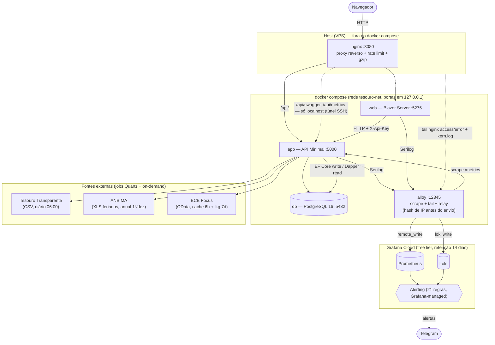

# Tesouro Direto API

API e front para consultar **títulos do Tesouro Direto**, seus **preços/taxas** (histórico e mais recente) e **simular investimentos** — valor bruto e líquido com **IOF** (tabela regressiva de 29 dias) e **IR** (faixa regressiva) já descontados, cupons semestrais quando o título paga juros, e **comparação de cenários** de projeção lado a lado. Os dados são ingeridos automaticamente de fontes públicas (Tesouro Transparente, ANBIMA e BCB Focus) e servidos por uma API REST (nível 3 de Richardson) consumida por uma interface web em Blazor.

> Solução .NET 8 em **Clean Architecture / Ports & Adapters**, mono-domínio com contextos (Títulos, Preços/Taxas, Tributos, Simulador, Feriados, Dias Úteis). Documentação de detalhe fino vive em [`docs/`](#estrutura-de-documentação) — este README **resume e aponta**, não duplica.

---

## Sumário

- [Arquitetura](#arquitetura)
- [API](#api)
- [Setup local](#setup-local)
- [Deploy e operação](#deploy-e-operação)
- [Estrutura de documentação](#estrutura-de-documentação)

---

## Arquitetura

Dois pontos de entrada — **API Minimal** (`TesouroDireto.API`) e **Blazor Server** (`TesouroDireto.Web`), que consome a API por HTTP. Ingestão por **jobs Quartz** de fontes públicas. **Observabilidade** via um único agente **Grafana Alloy** local (scrape de métricas, tail de logs) que reenvia (`remote_write`/`loki.write`) para o **Grafana Cloud** (free tier); métricas, logs, dashboards e alerting (Grafana-managed) vivem na nuvem, não na VPS.



**Serviços do `docker-compose.yml`:** `app`, `db`, `web`, `alloy` — sempre ativos. `prometheus` só sobe sob `--profile load` (`docker-compose.yml:210-217`), exclusivamente para o k6 fazer `remote_write` **local** durante teste de carga — as métricas `k6_*` nunca vão para a nuvem (cardinalidade alta e transiente); em repouso este serviço não roda e não custa memória. O **nginx roda no host** (não é serviço do compose) — sua config vem de [`infra/nginx/tesouro-direto.conf`](infra/nginx/tesouro-direto.conf) e é copiada para o nginx do sistema no deploy. Todas as portas do compose ficam ligadas a `127.0.0.1` (só a borda nginx é pública).

### Camadas do código (`src/`)

| Projeto | Papel |
|---------|-------|
| `TesouroDireto.Domain` | Entidades, Value Objects e regras; **Result Pattern** (sem exceções para fluxo de negócio). Zero dependências externas. |
| `TesouroDireto.Application` | Casos de uso em **CQRS via MediatR** (commands/queries) e *ports* (interfaces). `LoggingBehavior` no pipeline. |
| `TesouroDireto.Infrastructure` | *Adapters*: persistência (**EF Core** para escrita, **Dapper** para leitura → DTOs), clientes HTTP das integrações, cache, observabilidade. |
| `TesouroDireto.API` | Minimal API — endpoints finos que traduzem `Result` → HTTP; middleware de ApiKey/correlação; Swagger. |
| `TesouroDireto.Web` | Blazor Server; consome a API pelo typed client `TesouroApiClient`. |

Regra arquitetural travada por teste (`TesouroDireto.Architecture.Tests`): Application e Domain não referenciam Infrastructure.

### Decisões-chave (racional curto — detalhe em [`docs/MAPA.md`](docs/MAPA.md) e nas notas de *Feito* de [`docs/PLANO.md`](docs/PLANO.md))

- **`codigo` como identidade pública.** O identificador de título exposto na API é um *slug* determinístico de tipo + data de vencimento (ex.: `tesouro-selic-2029-03-01`), **derivado na leitura** (não persistido, sem coluna nem migration). Racional: o `uuid` interno é chave sintética que muda em reconstrução do banco (restore, nova fonte); a identidade natural sobrevive e desambigua títulos de mesmo tipo/ano com dias diferentes.
- **O `uuid` de Título não trafega no contrato público.** Rotas, request e DTOs de **títulos/preços** usam `codigo` (ou `nome`); o `uuid` de Título permanece só como chave de domínio interna (tarefa 38). O recurso de **configuração de tributos** é um caso à parte e segue identificado por `id` (`GET/PUT /configuracoes/tributos/{id}`, `Location` do `201`).
- **REST nível 3.** Leituras têm `ETag`/`304` condicional e `Cache-Control` (só em respostas 2xx), paginação por `Link` (RFC 8288) + `X-Total-Count`, `_links` HAL-like nos títulos, `405` + `Allow`, `HEAD`/`OPTIONS`. O front consome tudo isso (GET condicional, paginação real por `Link`).
- **Seed idempotente no boot.** Tributos (IOF/IR) e feriados são semeados na inicialização via CQRS — o banco sobe utilizável sem passo manual.
- **Resiliência + fallback nas integrações.** Retry/timeout (Polly) nos três clientes HTTP e *circuit breaker* no BCB; a projeção BCB tem cache *fresh* (6h) + *last-known-good* (7d), com fallback **apenas** em erro HTTP e **nunca silencioso** (log + campo `Origem` na resposta).
- **Observabilidade em 5 camadas** — negócio → app → dependências → borda (nginx) → host (VPS). Ver [`docs/analises/observabilidade.md`](docs/analises/observabilidade.md).

### Modelo de dados (resumo)

PostgreSQL, tabelas `snake_case`: `titulos`, `precos_taxas` (FK `titulo_id`), `tributos` + `tributo_faixas` (owned), `feriados`. Escrita por EF Core (migrations automáticas em Dev/Prod); leitura por Dapper devolvendo DTOs, com decorators de cache. Detalhe (índices, VOs, invariantes) em [`docs/MAPA.md`](docs/MAPA.md).

---

## API

Base local: `http://localhost:5000`. Em produção, via nginx: `http://SEU_HOST:3080/api`.

**Autenticação:** toda rota de negócio exige o header `X-Api-Key`. São **isentas**: `/health*`, `/metrics` e `/swagger`. Falha de autenticação retorna `401` em `application/problem+json`.

**Swagger (OpenAPI):** UI sempre montada em `/swagger`, sem exigir chave. Em produção o acesso é **só por túnel SSH** (o nginx bloqueia origem externa em `/api/swagger`) — ver [Deploy e operação](#deploy-e-operação).

### Rotas

As rotas de **leitura de negócio** (as `GET` da tabela abaixo, exceto `/health*` e `/metrics`, que são sondas de infraestrutura) aceitam também `HEAD`/`OPTIONS`, respondem `405` + `Allow` a métodos não suportados e enviam `ETag`, respondendo `304` a `If-None-Match` casado.

| Método | Rota | Auth | Descrição |
|--------|------|:----:|-----------|
| `GET` | `/health`, `/health/ready` | — | Readiness (checa o banco); `503` se o DB estiver fora. |
| `GET` | `/health/live` | — | Liveness (não toca o banco). |
| `GET` | `/metrics` | — | Métricas Prometheus. |
| `GET` | `/titulos?indexador&vencido` | `X-Api-Key` | Lista títulos (filtros opcionais); itens trazem `_links`. |
| `GET` | `/titulos/{codigo}` | `X-Api-Key` | Título por `codigo` (recurso único, `_links`). |
| `GET` | `/titulos/{codigo}/preco-atual` | `X-Api-Key` | Preço/taxa mais recente por `codigo`. |
| `GET` | `/titulos/{codigo}/precos?dataInicio&dataFim&page&pageSize` | `X-Api-Key` | Histórico por `codigo`; paginação opcional (`Link` + `X-Total-Count`). |
| `GET` | `/titulos/preco-atual?nome` | `X-Api-Key` | Preço/taxa mais recente por `nome`. |
| `GET` | `/titulos/precos?nome&dataInicio&dataFim` | `X-Api-Key` | Histórico por `nome` (intervalo opcional). |
| `GET` | `/configuracoes/tributos` | `X-Api-Key` | Lista tributos (IOF/IR) e faixas. |
| `GET` | `/configuracoes/tributos/{id}` | `X-Api-Key` | Tributo por id (alvo do `Location` do 201). |
| `POST` | `/configuracoes/tributos` | `X-Api-Key` | Cria tributo; `201` + `Location`. |
| `PUT` | `/configuracoes/tributos/{id}` | `X-Api-Key` | Atualiza tributo; `204`. |
| `POST` | `/simulador` | `X-Api-Key` | Simula um investimento; `Cache-Control: no-store`. |
| `POST` | `/simulador/cenarios` | `X-Api-Key` | Simula múltiplos cenários de projeção. |
| `POST` | `/importacao` | `X-Api-Key` | Dispara a importação do CSV do Tesouro (também roda por Quartz). |
| `POST` | `/importacao/feriados` | `X-Api-Key` | Dispara a importação de feriados da ANBIMA (também por Quartz). |

### Exemplos (curl)

Substitua `$API_KEY` pela sua chave e `{codigo}` por um `codigo` real (obtido em `/titulos`). Num ambiente recém-subido, dispare primeiro a importação para popular títulos e preços:

```bash
# 0. Popular títulos/preços a partir do CSV oficial (Tesouro Transparente)
curl -X POST http://localhost:5000/importacao -H "X-Api-Key: $API_KEY"

# 1. Listar títulos (cada item traz _links de navegação)
curl -s http://localhost:5000/titulos -H "X-Api-Key: $API_KEY"

# 2. Preço/taxa mais recente de um título
curl -s "http://localhost:5000/titulos/{codigo}/preco-atual" -H "X-Api-Key: $API_KEY"

# 3. Histórico paginado — repare em ETag, Link e X-Total-Count nos headers
curl -si "http://localhost:5000/titulos/{codigo}/precos?page=1&pageSize=25" -H "X-Api-Key: $API_KEY"

# 4. Repetir enviando o ETag recebido → 304 Not Modified (sem corpo)
curl -si "http://localhost:5000/titulos/{codigo}/precos?page=1&pageSize=25" \
  -H "X-Api-Key: $API_KEY" -H 'If-None-Match: "COLE_O_ETAG_AQUI"'
```

---

## Setup local

### Pré-requisitos

- **.NET 8 SDK** (target `net8.0`).
- **Docker** + plugin **Docker Compose** (usado tanto para subir a stack quanto pelos testes de integração via Testcontainers).
- **Node 20** — apenas para os testes E2E (Playwright).

### 1. Configurar o `.env`

Copie o template e preencha:

```bash
cp .env.example .env
```

O `docker-compose.yml` **falha o boot** se as variáveis obrigatórias estiverem ausentes ou vazias (`${VAR:?}`). Defina, **por nome** (valores são seus — para uso local qualquer valor não-vazio serve; os reais só importam em produção):

| Variável | Obrigatória | Observação |
|----------|:-----------:|------------|
| `API_KEY` | sim | Chave compartilhada entre API e Web (`X-Api-Key`). |
| `ADMIN_EMAIL` | sim | E-mail do usuário que recebe papel Admin aprovado automaticamente no boot. |
| `GC_PROM_URL` | sim | URL de `remote_write` do Prometheus do Grafana Cloud (página "Details" da stack). |
| `GC_PROM_USER` | sim | Username/Instance ID numérico do Prometheus do Grafana Cloud. |
| `GC_TOKEN` | sim | Access Policy Token com escopos `metrics:write` e `logs:write`. |
| `GC_LOKI_URL` | sim | URL de push do Loki do Grafana Cloud. |
| `GC_LOKI_USER` | sim | Username/Instance ID numérico do Loki do Grafana Cloud. |
| `GC_IP_SALT` | sim | Salt (gere com `openssl rand -hex 32`) do hash do IP de cliente nos logs de nginx, aplicado pelo Alloy **antes** do envio ao Grafana Cloud — exigência de LGPD (transferência internacional de dado pessoal, Res. CD/ANPD 19/2024). |
| `TELEGRAM_BOT_TOKEN` | não* | *Não é exigida pelo `docker compose` — a 77.4 removeu o serviço `grafana`, que era quem a exigia no boot. Ainda é exigida por `scripts/grafana-cloud/apply-cloud.sh`, que provisiona a entrega de alerta a partir do Grafana Cloud (placeholder serve localmente). |
| `DB_PASSWORD` | não | Senha do Postgres (default `app123`). |
| `GOOGLE_CLIENT_ID` / `GOOGLE_CLIENT_SECRET` | não | Credenciais de login OAuth Google (default vazio; `docker-compose.yml:166-167`). |

> As 8 primeiras variáveis são `${VAR:?}` no `docker-compose.yml`: faltar **qualquer uma** delas falha a interpolação do arquivo inteiro (o `docker compose up` nem chega a subir um container). `GRAFANA_PASSWORD` e `GRAFANA_ROOT_URL` de versões anteriores deste README **não existem mais** — a 77.4 removeu o serviço `grafana` do compose.
>
> Nunca faça commit do `.env` — ele está no `.gitignore`. Este README **não** contém valores, só nomes. Fonte de verdade: [`.env.example`](.env.example).

### 2. Subir a stack

```bash
docker compose up -d --build
```

Na inicialização a API roda as **migrations** e o **seed idempotente** (tributos IOF/IR + feriados). Endpoints:

- API — `http://localhost:5000` (Swagger em `http://localhost:5000/swagger`)
- Web (Blazor) — `http://localhost:5275`
- Alloy (debug) — `http://localhost:12345`: UI do agente (status dos componentes de scrape/tail); métricas e logs em si não têm UI local, vão direto para o Grafana Cloud.

Verifique a saúde:

```bash
curl -sf http://localhost:5000/health/ready && echo OK
```

Os **títulos/preços** só aparecem após uma importação (`POST /importacao`, exemplo acima) ou o job diário das 06:00.

### 3. Rodar os testes

```bash
# Suíte completa (xUnit + bUnit do Web) — precisa do Docker rodando (Testcontainers)
dotnet test
```

A suíte cobre Domain, Application, Infrastructure, API (integração HTTP com Postgres via Testcontainers), Web (bUnit) e Architecture. Os testes de cobertura de UI Blazor entram pelo projeto `TesouroDireto.Web.Tests`.

**E2E (Playwright)** — sobe a stack de E2E, semeia um banco efêmero e roda os specs:

```bash
# uma vez, para instalar o runner
cd tests/TesouroDireto.E2E.Tests && npm ci && npx playwright install --with-deps chromium && cd -

# a cada execução (a partir da raiz)
./run-e2e.sh
```

---

## Deploy e operação

### Pipeline (`.github/workflows/deploy.yml`)

`push` na `main` dispara três jobs em sequência: **test → e2e → deploy**.

1. **test** — `dotnet restore/build/test` com cobertura, seguido do **gate de cobertura** (`scripts/coverage-gate.py`, piso de linha em **80%**) e, se houver token, scan do SonarQube. `pull_request` roda só o `test`.
2. **e2e** — sobe `docker-compose.e2e.yml`, aguarda saúde, semeia `seed.sql` e roda os specs Playwright.
3. **deploy** — via SSH no VPS: escreve o `.env` com os secrets (inclusive as 6 `GC_*`), `git fetch` + `reset --hard origin/main`, copia a config do nginx e recarrega, `docker compose build` (sem `--no-cache`, removido na 74.0) e `up -d --remove-orphans`, `docker compose --profile load rm -sf prometheus` (`--remove-orphans` não recolhe serviço sob `profiles:`, então o `prometheus` do teste de carga é removido à parte) e `up -d --force-recreate --no-deps alloy` (a config do Alloy vem de bind-mount, que `up -d` sozinho não recria), aguarda `/health/ready` e limpa imagens órfãs (`.github/workflows/deploy.yml:226,236,253,257`).

**Secrets do GitHub necessários** (nomes apenas — valores nos *Settings → Secrets* do repositório):

`API_KEY`, `DB_PASSWORD`, `ADMIN_EMAIL`, `TELEGRAM_BOT_TOKEN`, `GOOGLE_CLIENT_ID`, `GOOGLE_CLIENT_SECRET`, `GC_PROM_URL`, `GC_PROM_USER`, `GC_TOKEN`, `GC_LOKI_URL`, `GC_LOKI_USER`, `GC_IP_SALT`, `VPS_HOST`, `VPS_USER`, `VPS_SSH_KEY`, `SONAR_TOKEN`, `SONAR_HOST_URL`.

### Acesso às ferramentas de operação (túnel SSH)

O Swagger e o endpoint `/metrics` da API em produção só respondem a `127.0.0.1` no nginx (`allow 127.0.0.1; deny all`, `infra/nginx/tesouro-direto.conf:75-91`). Não existe mais Grafana nem Prometheus locais para tunelar — métricas, logs, dashboards e alerting vivem no Grafana Cloud (ver [Dashboards e alertas](#dashboards-e-alertas) abaixo). O acesso operacional que ainda exige túnel SSH:

```bash
ssh -L 3080:localhost:3080 SEU_USUARIO@SEU_HOST
# depois, no navegador local:
#   Swagger  → http://localhost:3080/api/swagger
#   Métricas → http://localhost:3080/api/metrics
```

A UI de debug do Alloy (`127.0.0.1:12345` no host) não passa pelo nginx; para inspecioná-la, tunele a porta direto (`ssh -L 12345:localhost:12345 SEU_USUARIO@SEU_HOST`).

### Dashboards e alertas

Provisionados no **Grafana Cloud** (free tier, retenção de 14 dias) por `scripts/grafana-cloud/apply-cloud.sh`, que lê `infra/grafana/dashboards/` e `infra/grafana/cloud/` e aplica por API de forma idempotente (reconverge o que mudou e apaga da nuvem o que saiu da fonte).

- **Dashboards** — `tesouro-direto.json` (métricas de app e negócio: frescor do último preço, latência, erros, simulações) e `host.json` (CPU/memória/disco/rede coletados pelo `prometheus.exporter.unix` do Alloy). Existe um terceiro, `load-test.json`, que **não** sobe para a nuvem por desenho: lê o Prometheus efêmero do teste de carga (`--profile load`), que o backend SaaS não alcança; o `apply-cloud.sh` o remove da nuvem por convergência se alguém o subir manualmente.
- **Alertas** — 21 regras Grafana-managed (`infra/grafana/cloud/rules.yaml`, com `contactpoints.yaml`/`policies.yaml`), destino **Telegram**: dado velho (frescor > 48h útil), app down, DB/readiness down, taxa de erro 5xx alta, latência p95 alta, falha de import, simulador degradado (BCB indisponível), simulador com taxa de falhas alta, disco raiz acima de 85%, rate limit anômalo (429 na borda), memória de container acima de 85%/95% do limite, reclaim de memória sustentado, throttling de CPU sustentado, container reiniciou, OOM kill (métrica de container), métricas de container obsoletas (timer do host parado), OOM detectado no log de kernel, séries ativas do Grafana Cloud próximas do teto do free tier, overage de métricas ou logs do Grafana Cloud e projeção mensal de logs próxima do teto do free tier. Por avaliar na nuvem (fora da VPS), ausência de dado também dispara `NoData` → Telegram — um dead-man's switch que a stack antiga, hospedada na própria VPS, não tinha (se a VPS caía, o alerting calava junto). As 3 últimas (77.5) monitoram a saúde da própria ingestão do Grafana Cloud: se ela passar a ser rejeitada (free tier estourado), todos os outros 18 alertas ficam mudos sem aviso — isso precisa ser alerta, não dashboard que ninguém olha vazio.

### Rotina de manutenção

Teto de log nos dois acumuladores locais que restam para o disco não encher: Docker (`infra/host/daemon.json`, rotação do log-driver) e nginx (logrotate do pacote). Havia um terceiro acumulador local — o Loki desta stack, com retention de 30 dias reduzida a 7 dias na 74.2 — removido na 77.4; os logs hoje são reenviados pelo Alloy ao Loki do Grafana Cloud (retenção de 14 dias, free tier), fora do disco da VPS. O alerta "disco raiz acima de 85%" cobre a borda restante.

---

## Estrutura de documentação

As decisões vivem nos docs — mantenha-os como fonte de verdade e deixe este README apontando para eles.

- [`docs/PLANO.md`](docs/PLANO.md) — plano de melhorias por tarefa, cada uma com sua nota de *Feito* (o "porquê" das decisões e alternativas rejeitadas).
- [`docs/MAPA.md`](docs/MAPA.md) — mapa do sistema: rotas, modelo de dados, integrações, jobs/observabilidade e verificação de fragilidades.
- [`docs/arch/`](docs/arch/) — ADRs: caching da API ([`ARCH-001`](docs/arch/ARCH-001-api-caching.md)) e as notas de arquitetura do simulador/BCB/dias úteis (`F7a`–`F7d`).
- [`docs/analises/observabilidade.md`](docs/analises/observabilidade.md) — análise da stack de observabilidade (as 5 camadas).
- [`docs/comentarios-resgatados.md`](docs/comentarios-resgatados.md) — comentários preservados na limpeza de código.
- [`docs/load/README.md`](docs/load/README.md) — teste de carga k6 (API + circuitos SignalR do site), sob demanda, fora da pipeline.
